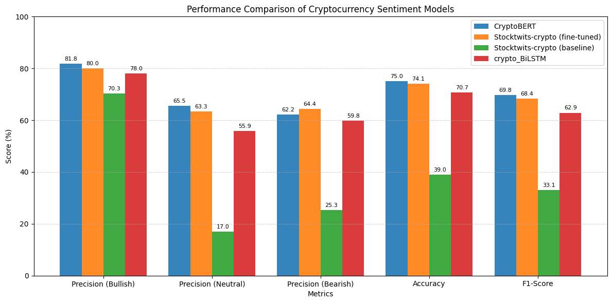

## Team 14  
Ke Xin Chong, Joel J Jude, Shinhaeng Lee, Wei Hong Low, Abhijith Sreeraj

---

## Introduction/Background

CryptoSentiment Pulse aims to develop an advanced NLP-based model for classifying cryptocurrency-related social media text into bearish, bullish, or neutral sentiments. Given the high volatility of cryptocurrency markets, sentiment analysis is crucial for understanding public perception and improving trading models (Kulakowski & Frasincar, 2023)[[1]](#1). However, the unique nature of cryptocurrency markets requires specialized sentiment analysis models that can accurately capture the nuances of this domain.

Despite the existence of general sentiment models, there is a scarcity of models specifically tailored for cryptocurrency-related texts. This scarcity leads to suboptimal classification accuracy when applying these models to financial contexts, where precise sentiment analysis is crucial for predicting market trends and making informed investment decisions. This research aims to bridge this gap by developing an advanced NLP-based model, CryptoSentiment Pulse, which integrates domain-specific features to improve sentiment classification in cryptocurrency-related social media posts.

Recent advancements in natural language processing have shifted sentiment trend analysis toward transformer-based models, such as BERT, due to their ability to capture contextual nuances in text. For instance, (Nguyen, Vu, and Nguyen, 2020)) [[5]](#5) introduced BERTweet, a pre-trained language model specifically fine-tuned on English tweets, demonstrating its effectiveness in processing the unique linguistic patterns.

---

## Problem Definition

Current sentiment analysis models often struggle to accurately capture the unique and rapidly evolving terminology used in cryptocurrency discussions. This limitation is exacerbated by the high volatility and specialized nature of cryptocurrency markets, leading to suboptimal sentiment classification and potentially impacting trading decisions. Currently, there are no open-source models specifically designed for analyzing crypto sentiment in tweets. The only existing model is limited to two predicted classes—bullish and negative—which fails to account for the prevalence of neutral sentiment in tweet text. To address this gap, there is a clear need for a three-class model that includes bullish, bearish, and neutral categories to better capture the full range of sentiments expressed on X platform.

---

**Motivation:**  
The highly volatile nature of cryptocurrency markets demands sentiment analysis models that go beyond generic NLP techniques. Traditional models often fail to capture the nuances of financial discourse, market sentiment shifts, and domain-specific jargon unique to crypto. By incorporating domain-specific features tailored to the cryptocurrency sector, a specialized model can provide deeper insights, more accurate sentiment predictions, and ultimately empower investors with data-driven strategies to navigate market fluctuations effectively.

---

## Methods

The approach involves two primary components: data preprocessing and machine learning techniques. Data preprocessing is crucial for ensuring that the dataset is clean and representative of the cryptocurrency domain, while the machine learning techniques are designed to effectively classify sentiments in social media posts.

### Data Preprocessing
1. **Text Cleaning:** 
   Raw tweet is often cluttered with URLs, multiple spaces, and retweet markers, which do not contribute to sentiment analysis but can introduce unwanted variability. Cleaning these elements ensures that models focus on linguistically meaningful content rather than irrelevant artifacts.

   At the same time, it is crucial to preserve financial and crypto-specific terms like tickers ($BTC, #ETH), as they carry sentiment-relevant information. A balanced cleaning approach ensures that preprocessing does not strip away valuable context.

2. **Tokenization:** 
   In sentiment analysis, converting raw text into a format that deep learning models can understand is essential. Tokenization is the first step in this process, where text is split into smaller units (tokens) and mapped to corresponding token IDs. This ensures that text data can be processed by machine learning models.

   Embeddings, such as those generated by models like BERT, are a critical part of tokenization. They allow text to be transformed into dense, continuous vector representations that capture both syntactic and semantic meaning. By mapping words or subwords to vectors, these embeddings enable models to understand the relationships between words, even if they have not seen those exact words during training.

   By using embeddings, tokenization ensures that the model can process text in a way that preserves context and meaning, making it easier for the model to interpret sentiment accurately and reducing the risk of misinterpretation due to poor token segmentation.

3. **Data Filtering:** 
   Not all text data contributes meaningfully to sentiment analysis. Social media content often contains ambiguous, contextless, or structurally complex text that can mislead models if not properly handled. Examples of such ambiguity include hashtag-only tweet, vague financial jargon, and mixed-content structures that combine multiple sentiments in a single post.

   Ambiguous text can arise in different ways: some posts may be too short to carry meaningful sentiment, while others may mix neutral statements with highly opinionated content, making it difficult to determine the overall sentiment. Additionally, posts that embed multiple perspectives—such as references to past performance alongside future predictions—can confuse models, leading to inconsistent classification.

   By trying to filter out text that lacks clear sentiment signals or introduces interpretative challenges, we minimize noise and improve the reliability of sentiment predictions. This ensures that the dataset consists of coherent and sentiment-rich text, allowing models to learn patterns more effectively and make more accurate predictions.

### Data Split
For the train-validation-test split we used a randomly split according to a fix random seed on the dataset (88647 data points) as follows:

- 80% - training set (36453 data points)
- 10% - validation set (4556 data points)
- 10% - test set (4558 data points)

All of the splits have the similar distribution across each different classes.

### ML Approaches
- **Unsupervised Clustering:** Explore the inherent structure of the tweet embeddings without relying on predefined labels. The goal is to determine if tweets naturally group by sentiment (Bullish, Neutral, Bearish). We experimented with several algorithms:
    - **HDBSCAN:** A density-based algorithm capable of finding clusters of varying shapes and identifying noise points, suitable for potentially complex embedding spaces.
    - **K-Means (MiniBatch):** A centroid-based algorithm partitioning data into a predefined number (k=3 for our sentiment classes) of clusters. Used MiniBatchKMeans for efficiency with larger datasets.
    - **BIRCH:** An algorithm suitable for large datasets that builds a tree structure to find clusters, also configured for k=3 target clusters.
    - **Pipeline:** All methods used tweet embeddings generated by Sentence Transformers (`all-MiniLM-L6-v2` and `all-mpnet-base-v2`), followed by UMAP for dimensionality reduction before applying the clustering algorithm. Cluster quality was evaluated using metrics like Adjusted Rand Index (ARI), Normalized Mutual Information (NMI) against ground truth labels, and internal metrics like Silhouette Score where applicable. We also analyzed the sentiment distribution within each identified cluster.
- **Supervised:**  
  - **Bert Models**
    - Finetune model using pretrain model ElKulako/stocktwits-crypto, the pretrain model originally has bullish, bearish and neutral labels. (Kulakowski & Frasincar, 2023)[[1]](#1)
    - Finetune model using pretrain model kk08/CryptoBERT, the pretrain model originally has only bullish and bearish labels. Thus, will discard the pre-trained weights of the original 2-label classification head and initialize a new classification head with random weights for 3 labels. These models are known for their ability to capture complex linguistic patterns and can be effectively adapted for domain-specific tasks. (Roumeliotis, Tselikas, & Nasiopoulos, 2024)[[4]](#4)
    - Both of these models train for 5 epoch, and select the best models in according to the least validation loss.
  - **BiLSTM model**
    - Implement a Bidirectional Long Short-Term Memory (BiLSTM) network to capture sequential context in text data. This architecture is particularly useful for modeling temporal relationships and has been applied in sentiment analysis for cryptocurrency markets. (Chen, Zhang, & Ye, 2019)[[6]](#6)

### Libraries and Tools
These methods utilize libraries such as scikit-learn for clustering, Hugging Face transformers for pre-trained models, and PyTorch for implementing neural networks.

### Dataset:
- **Source:** Financial Tweets on Cryptocurrency  
- **Volume:** ~57.9k tweets  
- **Labels:** Bearish (0), Neutral (1), Bullish (2)  
- **Link:** [Hugging Face Dataset](https://huggingface.co/datasets/StephanAkkerman/financial-tweets-crypto)

---

## Potential Results and Discussion

**Evaluation Metrics:**  
- **Accuracy:** This metric will assess the overall correctness of the model across all sentiment categories (bearish, neutral, bullish). It is particularly useful for balanced datasets.
- **Precision and F1-score:** These metrics will measure the true positive rate for each sentiment category. Precision will help evaluate how often the model correctly identifies a sentiment when it predicts it. The F1-score will provide a balanced evaluation by considering both precision and recall.

**Expected Outcomes:**  
We expect that fine-tuned Bert models, will outperform unsupervised methods like DBSCAN clustering and supervised BiLSTM networks. This is because transformer models are adept at capturing complex linguistic patterns and domain-specific terminology, which is crucial for accurately classifying sentiments in cryptocurrency-related texts.

The use of pre-trained models like CryptoBERT, as discussed by (Kulakowski & Frasincar, 2023)[[1]](#1), demonstrates the effectiveness of fine-tuning BERT-based models for cryptocurrency sentiment analysis. These models can better handle the nuances of cryptocurrency terminology and the dynamic nature of market sentiments compared to more general models.

Moreover, the performance of our models will be evaluated using metrics such as the F1 score, which provides a balanced measure of precision and recall, especially useful in imbalanced datasets. Additionally, metrics like Cohen's Kappa can be employed to assess the agreement between model predictions and human annotations, accounting for chance agreement

## Results and Discussion (Midterm Checkpoint)

In our midterm checkpoint, we implemented fine-tuned versions of pre-trained BERT and RoBERTa models on the `StephanAkkerman/financial-tweets-crypto` dataset, evaluating performance on the same train and test splits.

### Data Preprocessing Implementation
For our initial models, we implemented a comprehensive preprocessing pipeline that included:

1. **Text Cleaning:** 
   - For fine-tuning or evaluating the ElKulako/stocktwits-crypto model, we follow the same text-cleaning methods as outlined in the original paper in order to maintain consistency with the model's original training conditions. This ensures that our results are comparable and that the model's performance is evaluated under similar preprocessing conditions. The preprocessing steps includes removing unnecessary elements such as URLs, wallet addresses, special characters using regex patterns and etc.

   - For other models, we adopt a simpler and more minimalistic preprocessing approach to preserve the structure of the tweets, allowing deep learning models to learn more effectively. This involves removing URLs, eliminating retweet prefixes, stripping specific patterns, and cleaning up extra spaces.

2. **Tokenization:** We used the tokenizers from pre-trained models (BERT-based) to convert text into token IDs suitable for deep learning models.
   - ElKulako/stocktwits-crypto (RoBERTa-based): Since this model follows the RoBERTa architecture, it uses a byte-level Byte-Pair Encoding (BPE) tokenizer. This means the tokenization process is more flexible in handling out-of-vocabulary words, particularly financial and crypto-specific terminology. Unlike BERT, RoBERTa does not use segment embeddings, making it better suited for long financial text analysis.

   - kk08/CryptoBERT: This model follows the standard WordPiece tokenization used in BERT, which efficiently breaks down rare words into subwords. This ensures robust tokenization for domain-specific words while maintaining compatibility with BERT-based architectures.

3. **Data Filtering:** We excluded short texts (fewer than 2 words) and removed quote tweets to avoid confusion in sentiment scoring.
   - Short texts (e.g., #1inch, $OP) often lack meaningful context, making it difficult for the model to infer sentiment. Including such texts could introduce noise and negatively impact model performance.

   - Quote tweets contain both the original tweet and the user’s comment, making sentiment classification ambiguous. The model may struggle to determine whether the sentiment applies to the quoted content, the comment, or both, leading to inconsistent predictions. Thus it is removed.

### Chosen Models
1. **ElKulako/stocktwits-crypto baseline**
   - This model was originally trained on the StockTwits dataset, which consists of short financial post similar to tweets. Besides, all the posts are crypto related. Given its relevance, it is selcted to act as a benchmark for comparison with our finetune models (Kulakowski & Frasincar, 2023)[[1]](#1).
2. **ElKulako/stocktwits-crypto finetune**
   - We selected this model because it is already fine-tuned on financial social media text from StockTwits, a platform known for investment-related sentiment. It was specifically trained with bullish, bearish, and neutral sentiment labels, which perfectly align with our classification goals. This domain alignment reduces the amount of task-specific fine-tuning required and helps the model generalize well to our crypto-related sentiment data. By leveraging its pre-learned understanding of financial terminology and sentiment, we gain a strong starting point for accurate predictions with minimal retraining effort (Kulakowski & Frasincar, 2023)[[1]](#1). 
3. **kk08/CryptoBERT finetune**
   - This model was selected for this study due to its robust foundation and domain-specific advantages tailored to cryptocurrency sentiment analysis. CryptoBERT builds upon FinBERT, a model pre-trained on a large corpus of financial texts, which equips it with a strong base understanding of financial terminology, sentiment nuances, and contextual patterns (Araci, 2019)[[7]](#7). Additionally, this model is chosen is due to its pre-training on cryptocurrency-specific text, giving it an inherent understanding of the vocabulary, slang, and market dynamics unique to the crypto domain. Although it was originally trained for binary classification (bullish vs. bearish), we modified it by replacing the classification head to support three sentiment classes, allowing it to fit our task. This adaptation retained the model’s domain-specific strengths while making it flexible for multi-class classification. Using CryptoBERT ensures that the model can better interpret the nuanced language used in crypto discussions, which traditional general-purpose models might miss.
4. **crypto_BiLSTM**
   - This model was selected to explore a more traditional, RNN-based approach to sentiment classification that offers a contrast to transformer-based models like BERT. BiLSTMs (Bidirectional Long Short-Term Memory networks) are known for their ability to capture contextual dependencies in both directions by processing sequences forwards and backwards. This characteristic enables BiLSTMs to incorporate a richer understanding of text, particularly useful for short and informal inputs like tweets. We were especially interested in evaluating BiLSTM’s performance because it provides a simpler architecture with fewer parameters, making it more computationally efficient and potentially more practical for real-world deployment where resources are limited. Additionally, biLSTMs enable additional training by passing the text sequence twice. Therefore, the BiLSTM model completes additional training on a given dataset than LSTM, which helps to offer better predictions (Senaratne, 2021)[[8]](#8). Including BiLSTM in our study allows us to investigate whether a lightweight, domain-agnostic model can achieve competitive performance on our crypto-related sentiment classification task, and whether the added complexity of transformer models is always necessary.
5. **Unsupervised Clustering Models (HDBSCAN, KMeans, BIRCH)**
   - These models were chosen to explore whether unsupervised techniques could uncover meaningful sentiment groupings directly from the data embeddings, complementing the supervised approaches. The primary goal was to see if the inherent structure of the text, as captured by embeddings, aligns with the known sentiment labels.
   - **Sentence Transformers Embeddings:** We utilized pre-trained Sentence Transformer models (`all-MiniLM-L6-v2`, `all-mpnet-base-v2`) to convert tweets into dense vector representations suitable for clustering.
   - **UMAP Dimensionality Reduction:** To mitigate the curse of dimensionality and potentially improve clustering performance, UMAP was applied to reduce the embedding dimensions (e.g., to 20 or 30 components) while preserving topological structure.
   - **HDBSCAN:** Selected for its ability to handle noise and discover non-spherical clusters without pre-specifying the number of clusters. Parameter tuning focused on `min_cluster_size`, `min_samples`, `metric` (Euclidean, Cosine), and `cluster_selection_epsilon`.
   - **K-Means (MiniBatch):** Included as a standard baseline clustering method. We used the MiniBatch version for scalability and set the number of clusters to 3, corresponding to our target sentiments (Bullish, Neutral, Bearish).
   - **BIRCH:** Chosen for its memory efficiency on large datasets. It builds a hierarchical data structure (CF Tree) which allows for effective clustering, also set for 3 target clusters.
   - **Evaluation:** Clusters were evaluated by comparing their assignments to the ground truth sentiment labels using ARI and NMI. We also analyzed the sentiment purity within each cluster.

### Model Implementation and Evaluation

We implemented several models to establish benchmarks and assess performance on our cryptocurrency sentiment classification task:

#### Supervised Learning Models
  
1. **Fine-tuned BERT and RoBERTa Models:**
   - **ElKulako/stocktwits-crypto:** Fine-tuned from a RoBERTa model already trained on financial text with existing bullish, bearish, and neutral labels.
   - **kk08/CryptoBERT:** Adapted from a BERT model pre-trained on cryptocurrency text but with only bullish and bearish labels originally. We discarded the pre-trained weights of the original 2-label classification head and initialized a new 3-label classification head.
  
2. **Bidirectional LSTM:**
   - built using PyTorch. It consists of an embedding layer initialized with a vocabulary size and 128-dimensional embeddings, followed by a two-layer bidirectional LSTM with 256 hidden units per direction. The model concatenates the final forward and backward hidden states, applies dropout for regularization, and uses a fully connected layer to predict one of three sentiment classes.

#### Performance Metrics

We evaluated our models using several key metrics:

| Model                               | Precision (Bullish) | Precision (Neutral) | Precision (Bearish) | Accuracy | F1-Score |
|-------------------------------------|---------------------|---------------------|---------------------|----------|----------|
| kk08/CryptoBERT finetune            | 81.79               | 65.55               | 62.19               | 75.01    | 69.79    |
| ElKulako/stocktwits-crypto finetune | 80.01               | 63.33               | 64.42               | 74.10    | 68.39    |
| ElKulako/stocktwits-crypto baseline | 70.30               | 17.00               | 25.34               | 38.99    | 33.11    |
| crypto_BiLSTM                       | 76.56               | 58.48               | 60.07               | 70.95    | 70.02    |

*Figure 1: Comparing Crypto Sentiment Models – Precision, Accuracy, and F1-Score.*

### Analysis of Model Performance

Our analysis of the model performance revealed several key insights:

1. **Domain-Specific Pre-training Advantage:** The kk08/CryptoBERT model, which was pre-trained specifically on cryptocurrency text, outperformed the more general financial text model (ElKulako/stocktwits-crypto).

2. **Class Imbalance Impact:** All models showed better performance on the majority class (Bullish) compared to minority classes (Neutral and Bearish).

3. **Fine-tuning Benefits:** The significant performance gap between the fine-tuned models and the baseline demonstrates the effectiveness of transfer learning for this task.

In summary, **kk08/CryptoBERT** outperformed the other models, possibly due to the cleaner nature of its original training dataset, which was labeled directly by the authors. In cases where no label was assigned, the default sentiment was set to neutral. In contrast, the stephan/financial_tweets_crypto dataset used in our study contained noisier labels, as it was not annotated by the original authors, potentially leading to inconsistencies in sentiment classification.

#### Unsupervised Learning Models

We explored three clustering algorithms (HDBSCAN, K-Means, BIRCH) on tweet embeddings (`all-MiniLM-L6-v2` or `all-mpnet-base-v2` followed by UMAP reduction). The goal was to assess if tweets naturally cluster by sentiment. Clusters were mapped to sentiments based on the majority class within each cluster for evaluation purposes.

**Experimental Setup:**
- **Embeddings:** `all-MiniLM-L6-v2` or `all-mpnet-base-v2` from Sentence Transformers.
- **Dimensionality Reduction:** UMAP (e.g., `n_neighbors=15`, `n_components=20`, `metric='cosine'`).
- **Clustering Algorithms:**
    - HDBSCAN: Tuned `min_cluster_size`, `min_samples`, `cluster_selection_epsilon`.
    - KMeans (MiniBatch): `n_clusters=3`.
    - BIRCH: `n_clusters=3`, tuned `threshold`, `branching_factor`.
- **Evaluation:** Adjusted Rand Index (ARI), Normalized Mutual Information (NMI) against true labels, noise percentage (for HDBSCAN), and cluster purity analysis.

**Results Summary:**

Overall, unsupervised methods struggled significantly to produce clusters that align well with the ground truth sentiment labels.

| Model Configuration                     | ARI     | NMI     | Noise % | Notes                                                                 |
|-----------------------------------------|---------|---------|---------|-----------------------------------------------------------------------|
| KMeans (MiniLM, UMAP, k=3)   | 0.0044  | 0.0033  | N/A     | Clusters highly mixed, dominated by Bullish (~60% each). Poor separation. |
| BIRCH (MiniLM, UMAP, k=3)      | -0.0003 | 0.0027  | N/A     | Similar to KMeans, poor separation, clusters dominated by Bullish.      |
| HDBSCAN (MiniLM, UMAP, Euclidean) | ~0.01   | ~0.01   | 37.3%   | Initial attempt, high noise, very low Neutral/Bearish accuracy (~29%/7%). |
| HDBSCAN (MPNet, UMAP, Cosine) | ~0.02   | ~0.02   | 42.8%   | Changing embedding/metric slightly improved Neutral/Bearish mapping (~35%/9%) but increased noise. |
| HDBSCAN (MPNet, UMAP, Cosine, Tuned) | 0.025 | 0.021 | 35.0% | Slightly reduced noise, marginal improvement in mapping (e.g., Neutral ~38%, Bearish ~12%). |

**Cluster Purity Analysis (Example - KMeans):**
- **Cluster 0 (22513 samples):** Bullish: 61.3%, Neutral: 22.8%, Bearish: 15.9% (Mapped: Bullish)
- **Cluster 1 (5761 samples):** Bullish: 58.9%, Neutral: 23.3%, Bearish: 17.8% (Mapped: Bullish)
- **Cluster 2 (20418 samples):** Bullish: 59.2%, Neutral: 18.9%, Bearish: 21.9% (Mapped: Bullish)

This pattern of mixed clusters dominated by the majority 'Bullish' class was typical across KMeans and BIRCH. HDBSCAN identified significant noise but its formed clusters also showed limited sentiment purity, especially for Neutral and Bearish classes.

**Unsupervised Clustering Performance:**
Our exploration into unsupervised clustering (HDBSCAN, KMeans, BIRCH) revealed significant challenges in separating tweets based purely on sentiment using embedding structure. As shown in the results table, ARI and NMI scores were consistently close to zero, indicating that the cluster assignments were near random compared to the ground truth sentiment labels. Both KMeans and BIRCH produced clusters heavily dominated by the majority 'Bullish' class, failing to isolate distinct Neutral or Bearish groups. HDBSCAN, while capable of identifying noise (often capturing 35-45% of the data points), also struggled to form sentiment-pure clusters. Even after extensive parameter tuning across embedding models, distance metrics, UMAP settings, and HDBSCAN parameters, the resulting clusters remained highly mixed. This suggests that while embeddings capture semantic meaning, the semantic differences between Bullish, Neutral, and Bearish tweets in this dataset might be too subtle or overlapping for these unsupervised algorithms to effectively distinguish without explicit label guidance. The clusters likely formed around topics or writing styles rather than sentiment polarity alone.

<!-- Suggestion: Add confusion matrix visualization to show classification patterns -->

### Summary and Next Steps

#### Summary
Our initial results demonstrate that fine-tuned transformer-based models can achieve promising performance on cryptocurrency sentiment analysis, with the best model (kk08/CryptoBERT) achieving 75.01% accuracy and a macro F1-score of 69.79%.

#### Next Steps

1. **Unsupervised Learning Exploration:** For the next phase of our research, we plan to implement several unsupervised learning approaches to complement our supervised models. We will explore DBSCAN (Density-Based Spatial Clustering of Applications with Noise) as our primary clustering algorithm due to its ability to discover clusters of arbitrary shapes without requiring a predetermined number of clusters—a valuable feature when dealing with the nuanced language patterns in cryptocurrency discussions. Additionally, we intend to compare DBSCAN's performance with other clustering techniques such as K-means (for its simplicity and efficiency with large datasets) and BIRCH (Balanced Iterative Reducing and Clustering using Hierarchies) for its memory-efficient handling of large datasets. In theory, these unsupervised approaches will provide valuable insights into the natural groupings within cryptocurrency tweets that may not be captured by supervised models. By mapping these clusters to sentiment categories, we hope to identify linguistic patterns and topic-based sentiments that could enhance our overall classification framework. The implementation will involve converting tweets to embeddings using Sentence Transformers, applying dimensionality reduction techniques, and carefully tuning clustering parameters to achieve optimal results.

2. **Supervised Learning Exploration:** We would also plan to finalize the training of BiLSTM by the final report. In theory, BiLSTM should be well-suited for capturing contextual dependencies in sequential text data, allowing it to effectively classify sentiment in tweets by considering both past and future word contexts. While we have already implemented the BERT model, we aim to explore BiLSTM as a comparison to evaluate the performance trade-offs between traditional RNN-based approaches and transformer-based models. BiLSTM offers a simpler architecture with fewer parameters, making it more computationally efficient and potentially beneficial in scenarios with limited resources. Additionally, understanding how BiLSTM performs relative to BERT on our dataset provides insights into whether complex pre-trained models are necessary or if a more lightweight approach can achieve comparable results.

---

## References
<a id="1">[1]</a> M. Kulakowski and F. Frasincar, "Sentiment Classification of Cryptocurrency-Related Social Media Posts," *IEEE Intelligent Systems*, vol. 38, no. 4, pp. 5-9, July-Aug. 2023, https://doi.org/10.1109/MIS.2023.3283170. 

<a id="2">[2]</a> K. Qureshi and T. Zaman, "Social media engagement and cryptocurrency performance," *PLOS ONE*, vol. 18, no. 5, p. e0284501, May 2023, https://doi.org/10.1371/journal.pone.0284501.  

<a id="3">[3]</a> M. Wilksch and O. Abramova, "PyFin-sentiment: Towards a machine-learning-based model for deriving sentiment from financial tweets," *Int. J. Inf. Manag. Data Insights*, vol. 3, no. 1, p. 100171, 2023, https://doi.org/10.1016/j.jjimei.2023.100171.

<a id="4">[4]</a> Roumeliotis, K. I., Tselikas, N. D., & Nasiopoulos, D. K. (2024). LLMs and NLP Models in Cryptocurrency Sentiment Analysis: A Comparative Classification Study. Big Data and Cognitive Computing, 8(6), 63. https://doi.org/10.3390/bdcc8060063

<a id='5'>[5]</a> Nguyen, D. Q., Vu, T., & Nguyen, A. T. (2020). BERTweet: A pre-trained language model for English Tweets. In Q. Liu & D. Schlangen (Eds.), Proceedings of the 2020 Conference on Empirical Methods in Natural Language Processing: System Demonstrations (pp. 9–14). Association for Computational Linguistics. https://doi.org/10.18653/v1/2020.emnlp-demos.2

<a id='6'>[6]</a> Chen, X., Zhang, T., & Ye, Y. (2019). Sentiment analysis of comment texts based on BiLSTM. IEEE Access, 7, 51176–51185. https://doi.org/10.1109/ACCESS.2019.2909918

<a id='7'>[7]</a> Araci, D. (2019). FinBERT: Financial sentiment analysis with pre-trained language models. arXiv. https://arxiv.org/abs/1908.10063

<a id='8'>[8]</a> Senaratne, R. (2021). Text Classification using Bi-directional LSTM. Heartbeat. Retrieved from https://heartbeat.comet.ml/text-classification-using-bi-directional-lstm-ca0070df7a81

<a id='9'>[9]</a> Misingo, W. (2022). Machine Learning Text Clustering with DBSCAN. DEV Community. Retrieved from https://dev.to/wmisingo/machine-learning-text-clustering-with-dbscan-399n

---

## Gantt Chart

  

---

## Contribution Table

| **Team Member**    | **Contribution(Midterm)**                            | **Contribution(Proposal)**                            |
|--------------------|------------------------------------------------------|-------------------------------------------------------|
| Ke Xin Chong       | 1. Data Analysis  3. Implementaton of `kk08/CryptoBERT finetune`   4. Report Writing | 1. Project management  2. methodology design                |
| Joel J Jude        | 1. Report Writing  2. Visualisation    3. Unsupervised models implementation (WIP)                                                  | 1. Data processing   2. ML model implementation              |
| Shinhaeng Lee      | 1. Report Writing  2. BiLSTM (WIP)   3. Performance summarisation                                                   | 1. Data augmentation  2. preprocessing                      |
| Wei Hong Low       | 1. Implementaton of `ElKulako/stocktwits-crypto finetune`  2. Performance evaluation on `ElKulako/stocktwits-crypto finetune` baseline model   3. Report Writing  4. Cleaning method implementation                                                    | 1. Literature review   2. model evaluation                   | 
| Abhijith Sreeraj   | 1. Report Writing  2. Unsupervised models implementation (WIP)   3. Visualisation                                                      | 1. Report writing   2. visualization                         |

## Presentation Youtube Link

Proposal: https://youtu.be/cke5F-7VIsE
