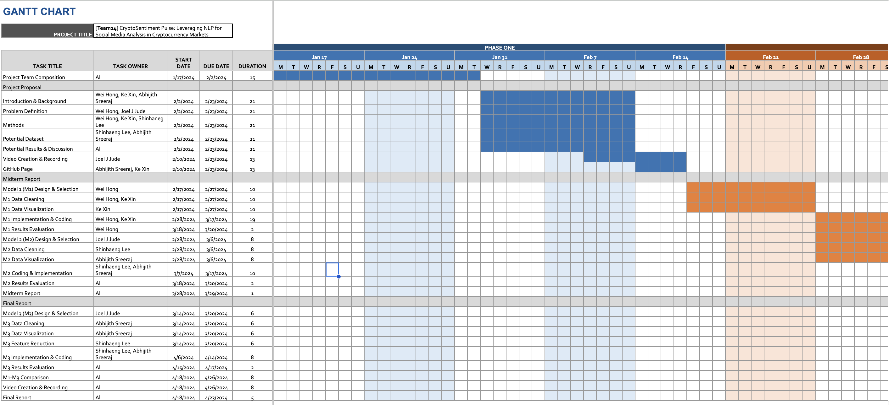

## Team 14  
Ke Xin Chong, Joel J Jude, Shinhaeng Lee, Wei Hong Low, Abhijith Sreeraj

---

## 1. Introduction/Background

CryptoSentiment Pulse aims to develop an advanced NLP-based model for classifying cryptocurrency-related social media text into bearish, bullish, or neutral sentiments.

**Dataset:**  
- **Source:** Financial Tweets on Cryptocurrency  
- **Volume:** ~57.9k tweets  
- **Labels:** Bearish (0), Neutral (1), Bullish (2)  
- **Link:** [Hugging Face Dataset](https://huggingface.co/datasets/StephanAkkerman/financial-tweets-crypto)

A brief literature review indicates that while general sentiment models exist, crypto-specific models are scarce, creating a significant gap in current research.

---

## 2. Problem Definition

Current sentiment analysis models do not adequately capture the unique and rapidly evolving terminology used in cryptocurrency discussions. This shortfall leads to less accurate sentiment classification in volatile crypto markets.

**Motivation:**  
There is an urgent need for a tailored model that incorporates financial domain-specific features to provide accurate and actionable sentiment analysis.

---

## 3. Methods

### Data Preprocessing
- **Cleaning:** Remove crypto wallet addresses, URLs, fix encoding errors, and filter noisy data.
- **Augmentation:** Use large language models (LLMs) to generate synthetic data and rephrase tweets while preserving sentiment.
- **Handling Imbalance:** Upsample or downsample categories as needed.
- **Word Embedding:** Transform text using Word2Vec or BERT embeddings.

### ML Approaches
- **Unsupervised:**  
  - Apply DBSCAN clustering to detect sentiment clusters.
- **Supervised:**  
  - Fine-tune pre-trained transformer models (e.g., RoBERTa, XLM-RoBERTa) with minor modifications (adding a dense layer).  
  - Implement a BiLSTM network to capture sequential context.

These methods utilize libraries such as scikit-learn, Hugging Face transformers, and PyTorch.

---

## 4. (Potential) Results and Discussion

**Evaluation Metrics:**  
- **Accuracy:** Overall and per-category correctness  
- **Precision and Recall:** To measure the true positive rate per sentiment category

**Expected Outcomes:**  
We anticipate that fine-tuned transformer models will outperform unsupervised methods and BiLSTM by better capturing crypto-specific terminology, leading to improved precision, recall, and overall accuracy.

---

## 5. References

1. M. Kulakowski and F. Frasincar, "Sentiment Classification of Cryptocurrency-Related Social Media Posts," *IEEE Intelligent Systems*, vol. 38, no. 4, pp. 5-9, July-Aug. 2023, doi: 10.1109/MIS.2023.3283170.  
2. K. Qureshi and T. Zaman, "Social media engagement and cryptocurrency performance," *PLOS ONE*, vol. 18, no. 5, p. e0284501, May 2023, doi: 10.1371/journal.pone.0284501.  
3. M. Wilksch and O. Abramova, "PyFin-sentiment: Towards a machine-learning-based model for deriving sentiment from financial tweets," *Int. J. Inf. Manag. Data Insights*, vol. 3, no. 1, p. 100171, 2023, doi: 10.1016/j.jjimei.2023.100171.

---

## Gantt Chart

  

---

## Contribution Table

| **Team Member**    | **Contribution**                                    |
|--------------------|-----------------------------------------------------|
| Ke Xin Chong       | Project management, methodology design              |
| Joel J Jude        | Data processing, ML model implementation            |
| Shinhaeng Lee      | Data augmentation, preprocessing                    |
| Wei Hong Low       | Literature review, model evaluation                 |
| Abhijith Sreeraj   | Report writing, visualization                       |
